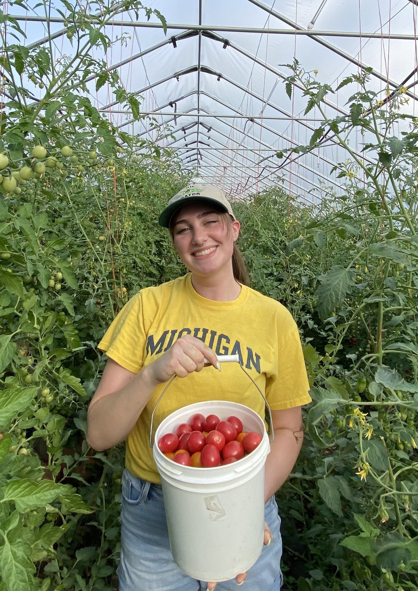

# GIS Portfolio
Welcome to my GIS portfolio. Below you can browse examples of my work. 

This portfolio can also be viewed by visiting [https://jaxgoodlabs.github.io/GIS_portfolio/](https://jaxgoodlabs.github.io/GIS_portfolio/). 

## About me 

My name is Ashton Gibson and I’m a undergraduate student at the University of Michigan studying PiTE.  
 
I first became interested in the social applications of  
 
This realization is what ultimately led me to Carnegie Mellon, and to Heinz College in particular. As the . 
 
My most recent projects have focused on public interest technologies that help to increase the range and accessibility of social services worldwide, especially as a means of increasing society's resilience to global threats like climate change. 
 
View my resume 
<a href="./assets/resume/Gibson,Ashton_UMich_Resume.pdf">here</a>.

#### Jump to Section
- [Google Map Styles](#google-maps-styles) 
- [ArcGIS Map Style](#arcgis-map-style-plant-growing-in-the-desert) 
- [Mecklenburg Hazard Evacuation Exercise](#mecklenburg-hazard-evacuation-exercise)
- [Mapping Damage from Hurricane Katrina](#mapping-damage-from-hurricane-katrina) 
- [Visualizing 412 Food Rescue Data with Kepler](#visualizing-412-food-rescue-data-with-kepler) 
- [Investigating Patterns in my Google Location Data](#investigating-patterns-in-my-google-location-data) 
- [Final Project: Hazus Flood Modeling for Miami, FL](#final-project-hazus-flood-modeling-for-miami-fl)
- [Sustainable Campus Project](#sustainable-campus-project) 
- [Sustainable City Project](#sustainable-city-project) 
- [Norwalk Transportation Project](#norwalk-transportation-project)
- [Pittsburgh EV Site Analysis Project](#pittsburgh-electric-vehicle-site-analysis) 
- [Optimizing Coverage of Hunting Areas for Maximum Removal of Burmese Pythons in South Florida](#optimizing-coverage-of-hunting-areas-for-maximum-removal-of-burmese-pythons-in-south-florida) 
- [Bumblebee Conservation in the Midwest US](#bumblebee-conservation-in-the-midwest-us)
- [put whatever name here](#test-section-1)

## Google Maps Styles

### People's Square
In this exercise, I used the [Google Maps Platform Styling Wizard](https://mapstyle.withgoogle.com/) to create my own Google Maps basemap, which I've named People's Square. To create the style, I first searched Google for an image (filtered by "marked for resuse" license) whose color scheme matched that of the map style I wanted to create. 

I ultimately settled on the following image of People's Square in Shanghai (photo by [f11photo](https://stock.adobe.com/contributor/201898682/f11photo?load_type=author&prev_url=detail) via [Adobe Stock](https://stock.adobe.com/), standard license):

I then used [Canva's color palette generator](https://www.canva.com/colors/color-palette-generator/) to create a custom color palette based on the image I had chosen. 

Back in the Google Maps Styling Wizard, I selected the "Dark" theme to serve as my base template and then proceeded to change the colors of various features using the hex codes from my custom color palette. A screenshot of the final product is displayed below. To access an interactive version of the map style, just click [here](https://jaxgoodlabs.github.io/GIS_portfolio/peoples-square.html).

### Night Glacier 2
The Night Glacier 2 style was inspired by this image of ice climbers exploring a glacier at night, which I again used Canva to convert into a custom color palette.

The resulting map style is presented below.

Click [here](https://jaxgoodlabs.github.io/GIS_portfolio/night-glacier-2.html) to access the interactive version.

[Return to top](#jump-to-section)

### Test Section 1