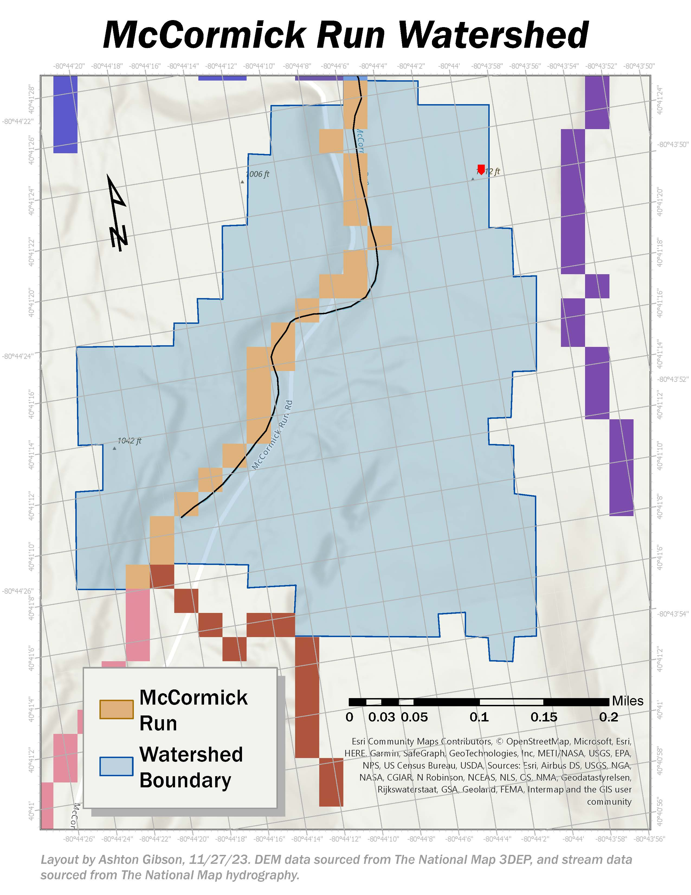

# GIS Portfolio
Welcome to my GIS portfolio! Below you can browse examples of my GIS coursework and personal cartography projects. 

## About me 

My name is Ashton Gibson and I’m an undergraduate student in the Program in the Environment at the University of Michigan. 
 
 
I am particularly interested in the field of GIS for the applications in environmental conservation, as well as the opportunites for facilitating scientific communication through mapping.
 
 
Through my coursework, I have become familiar with GIS skills such as:

- Creating and editing geospatial data
- Building workflow models to aid in analyses
- Performing spatial, interpolation, and geoprocessing analyses
- Using Hydrologic modeling toolsets in ArcGIS to conduct watershed analyses
- Working with digital elevation models
- Using/building 3D models and 3D Local Scenes in ArcGIS
- Creating interactive maps or uploading existing maps via ArcGIS Online
 
 

View my resume 
<a href="./assets/resume/Gibson,Ashton_UMich_Resume.pdf">here</a>.

#### Jump to Section
- [GIS Coursework Samples](#coursework-layouts)
- [Personal Projects](#qgis-layouts)

### Coursework Layouts
The layouts below are examples from my work in _Earth 408: Intro to GIS for Earth Science_. These projects were assigned and sourced from the textbook _Discovering GIS and ArcGIS Pro_ (Third Edition) by Bradley Shellito. 
 
 
#### #1- Suitability Analysis: 

 
In this assignment I employed ArcGIS Model Builder and Python script to analyze and edit multiple raster datasets at once using various raster calculations, ultimately outputting a dataset that displayed areas with the correct limiting criteria. 
  
 

#### #2- Watershed Analysis: 

 
 
 
 
Here I used a digital elevation model to calculate the watershed boundary, flow direction, and  stream order of the study area, using ArcGIS Hydrologic Modeling tools.
 
 
 
 
 
 
 
 

#### #3- Cost Path Analysis: 

 
 
 
 
This project shows the local 3D scene of a shaded relief of terrain. I calculated distance over a digital elevation model, and learned how the "cost" of a path is calculated and changed given different input parameters.
 
 
 
 
 
 
 
 
 
 
 
 
 
 
 
 

My **final project** for this course was a case study of Harmful Algal Bloom formation in a local lake, in which I conducted a watershed analysis via ArcGIS. My research poster can be viewed <a href="./assets/final_proj/final.pdf">here</a>.
 
 

### QGIS Layouts
These layouts are projects I've done for fun, to practice using QGIS and my cartographic design skills.
 
 

 
 
 
 
These layouts are an ongoing project of mine to display the bathymetry of all the Great Lakes. Here I was testing out two similar color ramps and display styles. 
 
 
 
 

 
This is another stylized example, this displayes the elevation of Mumbai.
 
 
 
 
 
 
 
 
 
 
 
 
 
 
 
 
 

I love my current work-study job at UMS, so to practice, I digitized all of our venues and offices and made a simple map of the area!
